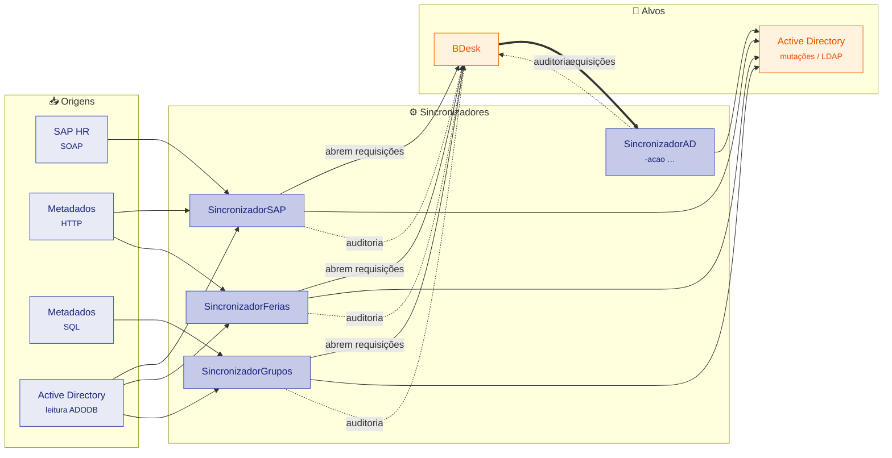

# Visão Geral

Os **Sincronizadores GAB** são uma suíte de **4 aplicações console .NET 8.0** (target `net8.0-windows8.0`) que mantêm usuários e grupos consistentes entre **Active Directory (AD)**, **SAP HR**, **Metadados (RH interno)**, **Azure AD** e o sistema de chamados **BDesk**.

Cada aplicação é um executável independente, agendado pelo **Windows Task Scheduler**, sem IIS nem serviço web. Todas leem fontes de RH e/ou o AD, decidem o que precisa mudar e materializam essas mudanças como mutações no Active Directory e/ou como requisições no BDesk.

!!! info "Características essenciais da suíte"
    - **Plataforma Windows-only.** A suíte depende de COM interop com **ADODB** e de **`System.DirectoryServices`**, ambos disponíveis apenas no Windows. Por isso o target é `net8.0-windows8.0` e não há versão multiplataforma.
    - **Todo o código em português.** Identificadores, comentários e strings estão em **português do Brasil**. Nomes reais de classe seguem esse padrão, como `ExecutorQuarentena` em `src/SincronizadorAd/Executores/`.
    - **Execução agendada, sem servidor web.** Cada app roda como processo console disparado pelo **Windows Task Scheduler**. Não há IIS, Kestrel nem endpoint HTTP exposto pela suíte.

## As 4 aplicações

| Aplicação | Projeto | O que faz |
|---|---|---|
| **SincronizadorAD** | `src/SincronizadorAd` | Executa mutações no Active Directory a partir de **10 ações** roteadas por `-acao`, consumindo requisições abertas no BDesk. As ações incluem `inserir`, `atualizar`, `manutencao`, `quarentena`, `retornar_quarentena`, `excluir`, `excluir_cpf`, `marcar_pendente` / `marcar_pendente_cpf` e `azure` (MFA via Microsoft Graph). |
| **SincronizadorSAP** | `src/SincronizadorSAP` | Passada principal de **merge de 3 origens** — SAP (SOAP) + Metadados (HTTP) + AD (via ADODB) — abrindo requisições BDesk de **Novos / Alterados / Excluídos** e gerenciando o ciclo de **quarentena** (`monitorar_quarentena`, `expirar_quarentena`). |
| **SincronizadorFerias** | `src/SincronizadorFerias` | Desabilita contas durante o período de férias manipulando o atributo `accountExpires` (FILETIME) e mantém um *watermark* `:CheckedOut:` no campo `streetAddress` para marcar a propriedade da automação. |
| **SincronizadorGrupos** | `src/SincronizadorGrupos` | Audita e sincroniza a **associação a grupos** e **campos de perfil** (description, office, department, company, display name, logon script) por **OU**, com configuração distribuída em arquivos `config.txt`. |

## Fluxo de dados

O diagrama abaixo mostra como as **origens** alimentam os **sincronizadores**, que por sua vez atuam sobre os **alvos** (AD e BDesk):

O **BDesk tem papel duplo** no fluxo:

- **Fila de requisições (origem do SincronizadorAD):** o SincronizadorSAP, o SincronizadorFerias e o SincronizadorGrupos *abrem* requisições no BDesk. O SincronizadorAD *consome* essas requisições abertas e executa a mutação correspondente no Active Directory.
- **Registro de auditoria (destino dos demais):** cada sincronizador também *posta* o resultado de suas ações no BDesk (sucesso, erro, aguardando), de modo que o BDesk funciona como trilha de auditoria das mudanças aplicadas.

!!! tip "Ciclo de quarentena cross-project"
    A quarentena é uma automação **entre dois projetos**:

    - **O SincronizadorSAP detecta** — via `-acao monitorar_quarentena` (login após a entrada em quarentena → abre requisição de retorno) e `-acao expirar_quarentena` (30+ dias sem login → abre requisição de exclusão).
    - **O SincronizadorAD executa** — via `-acao retornar_quarentena` (move o usuário de volta à OU original gravada em `msDS-cloudExtensionAttribute1`) e `-acao excluir` (remove a conta após verificar recontratação).

    O detalhamento completo está em [Ciclo de Vida da Quarentena](negocio/ciclo-vida-quarentena.md), na seção **Negócio**.

## Como navegar

A documentação está organizada em três seções, cada uma voltada a um perfil de leitura:

| Seção | Conteúdo | Perfil de leitura |
|---|---|---|
| **Negócio** | Regras de cada sincronizador (geração de login, quarentena, férias, grupos) e o ciclo de vida da quarentena, descritas em linguagem orientada ao comportamento. | Analistas de negócio, equipe de RH/identidade e quem precisa entender *o que* o sistema decide e *por quê*. |
| **DevOps** | Build, configuração (INI + JSON + XOR), agendamento no Task Scheduler, deploy e operação dos servidores. | Equipe de infraestrutura e operação que mantém os jobs rodando em produção. |
| **Referência** | Mapeamento detalhado de ações, atributos AD, tokens de template e a lista de **discrepâncias** entre documentos e código. | Desenvolvedores e mantenedores que precisam dos nomes reais de classe/método e dos pontos onde a documentação antiga diverge do código. |

## Ambiente de produção

| Servidor | Papel | Caminho de deploy |
|---|---|---|
| **GAB13013i** | Ativo | `F:\BusinessDesk\ASK\` |
| **GAB13011i** | Standby | `F:\BusinessDesk\ASK\` |

As 4 aplicações são publicadas sob `F:\BusinessDesk\ASK\{NomeDaAplicacao}\` em cada servidor.

!!! warning "Aplicar mudanças em ambos os servidores"
    Não há failover automático evidenciado em código — os hosts **GAB13013i (ativo)** e **GAB13011i (standby)** apenas coexistem. Qualquer mudança de binário, configuração (`conf.ini`, `config.json`, templates JSON, listas negras) ou agendamento deve ser **aplicada manualmente em ambos os servidores**, sob pena de comportamento divergente em caso de troca de host.

---

!!! note "Lembrete sobre idioma e nomes reais"
    Toda esta documentação é escrita em **português do Brasil**, em coerência com o código-fonte, que também está integralmente em português. Ao citar comportamento, sempre referenciamos identificadores reais — por exemplo, a classe `ExecutorQuarentena` em `src/SincronizadorAd/Executores/`. Nomes de classe, método e atributo nesta documentação correspondem ao que existe no código.
