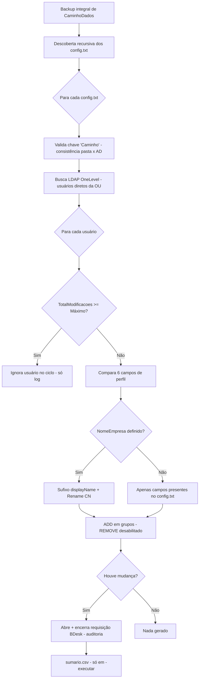

# Regras do Sincronizador Grupos

O **SincronizadorGrupos** é uma aplicação console .NET 8.0 que **audita e sincroniza** dois aspectos dos usuários do Active Directory:

1. **Associações de grupos AD** — adiciona usuários aos grupos declarados para cada OU.
2. **Campos de perfil** — mantém seis atributos do usuário alinhados ao padrão definido para a OU.

Os usuários são organizados em **árvores hierárquicas de OUs**, e a configuração é **descentralizada por OU**: cada OU possui seu próprio arquivo `config.txt` dentro de uma **estrutura de diretórios espelhada** apontada por `CaminhoDados`. A descoberta dos arquivos de configuração é recursiva, e cada execução produz um backup integral, respeita um teto de alterações e comunica cada mudança ao BDesk via fila JSON de requisições.

!!! info "Arquivos-chave"
    - `src/SincronizadorGrupos/Program.cs` — ponto de entrada e roteamento de modos.
    - `src/SincronizadorGrupos/ExecutorSincronizadorGrupos.cs` — lógica de auditoria e sincronização.
    - `src/SincronizadorGrupos/instrucoes-configuracao/EXEMPLOS/` — exemplos de `conf.ini`, `abertura.json` e `encerramento.json`.

---

## Modos de execução

| Modo | Efeito no AD | Backup | `sumario.csv` |
|------|--------------|--------|----------------|
| `-executar` | Aplica alterações de campos e grupos | Sim | Sim |
| `-consultar` | Dry-run — não deveria alterar o AD | Sim | Não |

!!! warning "O modo `-consultar` NÃO é totalmente seguro até correção"
    Existe um defeito conhecido (descrito mais adiante) em que a **renomeação de CN** ocorre mesmo em modo `-consultar`. Trate o `-consultar` como **não inteiramente seguro** para usuários cuja OU define `NomeEmpresa`, até que o bug seja corrigido. Defeito documentado no `CLAUDE.md` (linha 177).

---

## Campos de perfil sincronizáveis

São **exatamente seis** os campos de perfil que podem ser sincronizados. O dicionário `MapeamentoCampos` (`ExecutorSincronizadorGrupos.cs`, linhas 272-277) define o mapeamento entre o nome amigável usado no `config.txt` e o atributo real do AD:

| Nome no `config.txt` | Atributo AD |
|----------------------|-------------|
| `Description` | `description` |
| `Office` | `physicalDeliveryOfficeName` |
| `Department` | `department` |
| `Company` | `company` |
| `Logon Script` | `scriptPath` |
| `Display Name` | `displayName` |

!!! note "Ausência de campo = campo não sincronizado"
    Cada um dos seis campos é **opcional**. Se um campo **não está presente** no `config.txt` daquela OU, ele **não é sincronizado** para os usuários daquela OU. A lógica filtra apenas os campos cujo valor existe no `config.txt` e difere do valor atual no AD (linhas 529-535). Os demais campos são apenas registrados como "Mantido" no log e ignorados (linhas 566-569).

---

## Estrutura de configuração por OU

A configuração é **distribuída por OU**, em uma estrutura de pastas que **espelha a árvore de OUs do AD** sob `CaminhoDados`.

### Descoberta recursiva dos `config.txt`

Todos os arquivos `config.txt` são descobertos recursivamente em uma única varredura:

```text
Directory.GetFiles(CaminhoDados, "config.txt", SearchOption.AllDirectories)
```

(`ExecutorSincronizadorGrupos.cs`, linha 321). Cada `config.txt` encontrado é processado individualmente.

### Busca LDAP por OU — escopo `OneLevel`

A busca de usuários em cada OU usa **`SearchScope.OneLevel`** com filtro `(objectClass=user)` (linha 690):

```csharp
var directorySearcher = new DirectorySearcher(directoryEntry, "(objectClass=user)", Campos, SearchScope.OneLevel);
```

!!! important "Sub-OUs exigem seu próprio `config.txt`"
    O escopo `OneLevel` retorna **apenas os usuários diretos da OU**, sem descer para sub-OUs. Em nenhum lugar do projeto há `SearchScope.Subtree`. Portanto, **cada sub-OU precisa de seu próprio `config.txt`** para ser processada — a configuração de uma OU-pai não se propaga para as filhas.

### Validação de consistência: a chave `Caminho`

Cada `config.txt` de OU **deve conter a chave `Caminho`** (definida em `CamposObrigatoriosArquivoDaOU`, linhas 31-34). Esse valor permite uma **auto-verificação** entre a estrutura de pastas e a árvore do AD: o sistema reconstrói o caminho esperado a partir do valor de `Caminho` e o compara com a localização real do arquivo (linhas 444-453).

!!! danger "Desalinhamento gera erro"
    Se o `Caminho` declarado não corresponde à posição do arquivo na estrutura de diretórios, é registrado um erro de validação com a mensagem: *"Este valor é difente do esperado e pode indicar que o arquivo foi salvo no diretório errado."* Isso protege contra `config.txt` salvos na pasta errada.

---

## Configuração obrigatória do `conf.ini`

A seção `[Geral]` do `conf.ini` exige **três chaves obrigatórias** (`CamposObrigatoriosIni`, linhas 25-30):

```ini
[Geral]
CaminhoDados = D:\...\dados-ou-qualquer-nome-de-pasta
CaminhoBackups = F:\...\backups-ou-qualquer-nome-de-pasta
MaximoAlteracoesPorExecucao = 10
```

| Chave | Função |
|-------|--------|
| `CaminhoDados` | Raiz da estrutura espelhada de OUs e dos arquivos `config.txt`, `grupos.txt` e `sumario.csv` |
| `CaminhoBackups` | Destino dos backups integrais de `CaminhoDados` |
| `MaximoAlteracoesPorExecucao` | Teto de alterações por execução |

!!! warning "Sem valor-padrão embutido"
    Não há *default* para essas chaves. Se qualquer uma estiver ausente, a validação lança exceção durante a inicialização.

---

## Backup integral

Antes do processamento, o sistema copia **todo o conteúdo de `CaminhoDados`** para `CaminhoBackups`, em uma subpasta com timestamp no formato `yyyy-MM-dd_HH-mm-ss-ffffff` (linhas 282-289).

!!! note "Backup ocorre em AMBOS os modos"
    A criação do backup está dentro de `ExecutarPrincipal()` **sem nenhuma verificação de `ModoConsultar`**. Portanto, o backup integral é gerado tanto em `-executar` quanto em `-consultar`.

---

## Limite de alterações (`MaximoAlteracoesPorExecucao`)

A cada usuário processado, antes de qualquer modificação, o sistema verifica o teto (linhas 505-510):

```csharp
if (TotalModificacoes >= MaximoAlteracoesPorExecucao)
{
    // ... return
}
```

Quando o teto é atingido, **qualquer modificação no AD é bloqueada**, mas o **logging/auditoria continua até o fim da execução**.

!!! info "Usuário que atinge o teto é completamente ignorado no ciclo"
    Para o usuário que dispara o `return` por atingir o limite:

    - **Nenhuma alteração** de campos de perfil (linha 582).
    - **Nenhuma renomeação** de CN (linha 550).
    - **Nenhum `CommitChanges()`** (linha 592).
    - **Nenhuma alteração** de grupos (linha 598).
    - **Nenhuma requisição BDesk** aberta (linha 640).
    - **`TotalModificacoes` não incrementa** (linha 610) — e, como o `return` ocorre antes, **`TotalInteracoes` também não incrementa** (linha 602).

    Ou seja, o usuário é **omitido por completo** do ciclo, sem mudança no AD nem no BDesk.

---

## Segurança: remoção de grupos desabilitada

A operação que removeria um usuário de um grupo está **permanentemente desabilitada** por medida de segurança, envolvida em `if(false)` (linhas 755-761). **Apenas a operação `ADD`** está ativa (linhas 746-751).

!!! tip "O sincronizador só adiciona, nunca remove"
    Na prática, o SincronizadorGrupos **só adiciona** usuários aos grupos declarados. Ele **jamais remove** um usuário de um grupo, mesmo que o usuário esteja em grupos não listados. Confirmado no `CLAUDE.md` (linhas 65, 179, 216).

---

## Sufixo de empresa (`NomeEmpresa`) e renomeação de CN

Quando o `config.txt` da OU contém a chave **`NomeEmpresa`** (linhas 538-551):

1. O `displayName` recebe o sufixo `({NomeEmpresa})` — a parte entre parênteses anterior é descartada e substituída.
2. Se o novo `displayName` difere do `displayName` atual, ele entra na lista de campos a alterar.
3. Se o novo `displayName` difere do **CN** atual, o **CN é renomeado** via `userEntry.Rename("CN=" + displayName_Novo)` para refletir o novo `displayName`.

```csharp
if (!displayName_Novo.Equals(userEntry.Properties["cn"].Value))
{
    userEntry.Rename("CN=" + displayName_Novo);   // linha 550
}
```

!!! warning "BUG conhecido: renomeação de CN ocorre em modo `-consultar`"
    A chamada `userEntry.Rename(...)` na **linha 550** **não é precedida por verificação de `ModoConsultar`**. Diferente do restante do código — que protege alterações de propriedades (linhas 576-579), `CommitChanges()` (linhas 589-594) e alterações de grupos (linhas 775, 787) atrás de checagens de `ModoConsultar` —, o `Rename()` executa **imediatamente no AD** (não requer `CommitChanges`).

    **Consequência:** em modo `-consultar` (dry-run), o CN de um usuário **ainda assim é renomeado** quando a OU define `NomeEmpresa`. Isso torna o dry-run inseguro nesse cenário. Defeito documentado no `CLAUDE.md`, linha 177. **Trate `-consultar` como não totalmente seguro até a correção.**

---

## Declaração de grupos

### Chave `Grupos` no `config.txt`

Os grupos a sincronizar para a OU são declarados na chave **`Grupos`** do `config.txt`, como uma **lista separada por ponto e vírgula** (`;`) (linhas 459-492, 720-725).

| Situação | Comportamento |
|----------|----------------|
| Chave `Grupos` ausente (`null`) | OU **sem sincronização de grupos** — `AlterarGrupos` retorna `false` imediatamente (linhas 461, 722-724) |
| `Grupos` presente, mas vazio | Coleção vazia após filtragem — nenhum grupo a adicionar (linhas 467-469) |
| `Grupos` com CNs | Usuário é adicionado a cada grupo correspondente (operação `ADD`) |

### Arquivo `grupos.txt`

O arquivo `grupos.txt`, localizado em `CaminhoDados`, lista os **CNs de grupos a gerenciar**, **um por linha** (`CarregarGrupos`, linhas 343-406). Regras de parsing:

- Linhas **vazias** são ignoradas.
- Linhas de **comentário** iniciadas por `#` ou `;` são ignoradas.
- Cada CN restante é validado contra o AD via busca LDAP.

```text
# Comentário ignorado
; Outro comentário ignorado
Grupo-VPN
Grupo-Internet
```

---

## Auditoria via BDesk (fila JSON)

Toda mudança em **campos de perfil e/ou grupos** gera uma **requisição BDesk para fins de auditoria**, aberta e encerrada **no mesmo ciclo** (linhas 639-649):

1. O JSON de **abertura** é adicionado à fila via `AdicionarRequisicaoEmFila`.
2. `ProcessarFilaRequisicoesPendentes` (em `ExecutorSincronizador.cs`) processa imediatamente: faz `POST /v1/requisicoes/abrir`, move o arquivo para `ENVIADOS/`, e em seguida `POST /v1/requisicoes/{id}/acoes` para o **encerramento**.

Assim, a requisição é **aberta e fechada no mesmo ciclo**, deixando o rastro de auditoria sem deixar requisições pendentes.

### Tokens de substituição nos templates

Os templates JSON (`abertura.json`, `encerramento.json`) usam tokens substituídos em tempo de execução:

| Token | Valor |
|-------|-------|
| `%LOGIN_ALTERADO%` | `sAMAccountName` do usuário alterado |
| `%ALTERACOES%` | `TextoAlteracoes` acumulado (descrição das mudanças) |
| `%PARTICIPANTE_POR_OU%` | Login do solicitante mapeado por OU |

!!! note "Resolução de `%PARTICIPANTE_POR_OU%`"
    O login do solicitante é resolvido a partir de `mapeamento-participantes.json`, usando a **OU mais profunda** (último nível hierárquico) do `distinguishedName` do usuário como chave. Se não houver mapeamento para essa OU, aplica-se o **fallback**: o login do robô em execução **sem o primeiro caractere** (`UsuarioBDeskRoboEmExecucao.Login.Substring(1)`, equivalente a `robot-login[1:]`) — linhas 629-631.

---

## Sumário CSV

A cada execução em modo `-executar`, uma linha é anexada ao arquivo **`sumario.csv`**, localizado em `CaminhoDados`.

!!! note "Gravado apenas em modo `-executar`"
    O `sumario.csv` é gravado **exclusivamente em modo `-executar`** — **nunca em `-consultar`** (linhas 173-190). A função retorna no início quando `ModoConsultar` é verdadeiro, antes de qualquer gravação.

O cabeçalho é criado na primeira execução:

```text
Data,Hora,Interações,Alterações,Mensagens de erro
```

Cada linha registra uma execução com:

| Coluna | Conteúdo |
|--------|----------|
| `Data` | Data da execução (`yyyy-MM-dd`) |
| `Hora` | Hora da execução (`HH:mm:ss`) |
| `Interações` | `TotalInteracoes` — usuários processados (incrementado por usuário, linha 602) |
| `Alterações` | `TotalModificacoes` — usuários com mudanças (incrementado só quando há alteração, linha 610) |
| `Mensagens de erro` | Quantidade de mensagens de erro acumuladas no ciclo |

---

## Pipeline resumido por OU



---

## Discrepâncias entre documentação e código

!!! warning "Divergências registradas (o código vence)"
    - **`config.txt` da OU — chave `Caminho` obrigatória**: a chave `Caminho` é validada por OU (linhas 31-34, 444-453). Já na seção `[ActiveDirectory]` do `conf.ini`, a chave `Caminho` é **usada obrigatoriamente em tempo de execução (linha 302)**, porém **não está incluída na validação de inicialização** (`CamposObrigatoriosIni`, linhas 25-30) — *latent bug* que pode lançar `KeyNotFoundException` se ausente. `CaminhoGrupos` é genuinamente opcional (verificado via `ContainsKey`).
    - **Seção `[BDesk]`**: obrigatória em modo `-executar`. Quando `[BDesk]` existe mas `Executar != "true"`, ativa-se o modo de fila `FILA-MODO-CONSULTA` sem abertura de requisições (linhas 216-220). A ausência total de `[BDesk]` em `-executar` falha na validação antes de ativar qualquer fila.
    - **Bug do `Rename()` em dry-run**: confirmado em `ExecutorSincronizadorGrupos.cs` (linhas 548-550) — o `Rename()` não está protegido por `if (!ModoConsultar)`, ao contrário das demais operações de escrita.
    - **`MaximoAlteracoesPorExecucao` (default)**: a documentação registrava o *default* como "a confirmar"; o código lê a configuração **sem default visível** (linha 121) — a chave é obrigatória na seção `[Geral]`.
