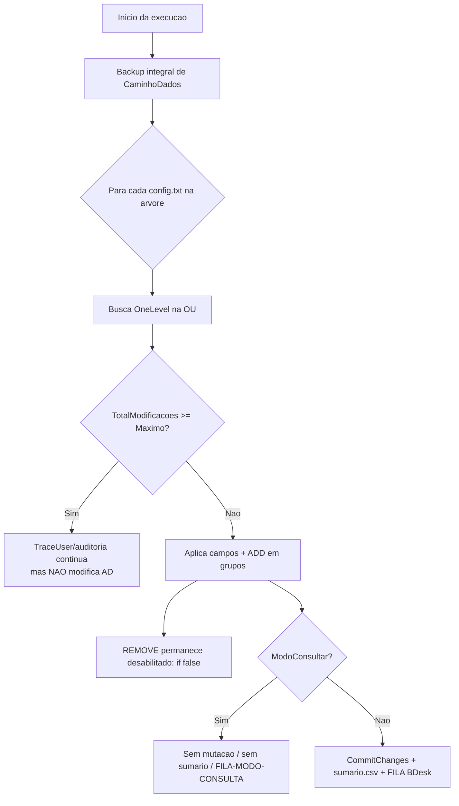

# Regras do Sincronizador Grupos

O **SincronizadorGrupos** e uma aplicacao console **.NET 8.0** que **audita e sincroniza** a associacao de usuarios a grupos de Active Directory e um conjunto de **campos de perfil** (Description, Office, Department, Company, Logon Script, Display Name). Os objetos sao organizados em uma **arvore hierarquica de OUs**, e a configuracao e **descentralizada por OU** atraves de arquivos `config.txt` espalhados na estrutura de pastas.

O comportamento central esta concentrado em `ExecutorSincronizadorGrupos.cs`. A aplicacao foi desenhada com varias travas de seguranca: teto de alteracoes por execucao, remocao de grupos permanentemente desabilitada, backup integral antes de qualquer passada e modo de simulacao (`-consultar`).

!!! info "Arquivo-chave"
    `src/SincronizadorGrupos/ExecutorSincronizadorGrupos.cs` concentra toda a logica descrita nesta pagina. As demais regras transversais (modos de execucao, fila BDesk) vivem na classe base `ExecutorSincronizador` (`src/SincronizadorGrupos/.../ExecutorSincronizador.cs`).

---

## 1. Seguranca: teto de alteracoes por execucao (blast radius)

Para limitar o raio de impacto de uma execucao, o bot respeita o parametro **`MaximoAlteracoesPorExecucao`**. Cada usuario que efetivamente sofre alteracao incrementa `TotalModificacoes`.

No lambda de processamento de cada usuario, a **primeira instrucao** verifica o teto:

```csharp
// ExecutorSincronizadorGrupos.cs, linhas 505-510
if (TotalModificacoes >= MaximoAlteracoesPorExecucao)
{
    Trace.WriteLine("Número máximo de modificações excedido. Nada será modificado no ActiveDirectory.");
    TraceHelper.WriteLineIdentada("TotalModificacoes           : " + TotalModificacoes);
    TraceHelper.WriteLineIdentada("MaximoAlteracoesPorExecucao : " + MaximoAlteracoesPorExecucao);
    return;
}
```

Ao atingir `TotalModificacoes >= MaximoAlteracoesPorExecucao`, o **early return** no lambda impede:

- alteracoes de **campos de perfil** (linhas 512-596);
- alteracoes de **grupos** (`AlterarGrupos`, linha 598);
- **abertura de requisicoes BDesk** (linhas 611-646).

!!! warning "A auditoria NUNCA para"
    O teto interrompe apenas as **modificacoes no AD**, nao a auditoria. O metodo `TraceUser(usuario, caminho)` e chamado **antes** do lambda de acao (linhas 708-709), portanto o logging de cada usuario continua sendo gravado mesmo depois que o limite e atingido. O segundo passe ("depois") tambem continua iterando sobre todos os usuarios ja percorridos.

---

## 2. Remocao de usuarios de grupos: PERMANENTEMENTE desabilitada

Por seguranca, o bot **so adiciona** usuarios a grupos (acao `ADD`). A remocao (`REMOVE`) e uma decisao intencional de design para evitar que uma configuracao incorreta retire acessos em massa.

O bloco que definiria `acao = "REMOVE"` esta encapsulado em um `if (false)`, tornando-o inalcancavel:

```csharp
// ExecutorSincronizadorGrupos.cs, linhas 753-762
else
{
    if (false)
    {
        if (gruposAtuais.Contains(grupo.Key))
        {
            acao = "REMOVE";
        }
    }
}
```

O codigo que **trataria** a acao `REMOVE` (remover o DN de `member` e commitar) ainda existe nas linhas 784-795, porem **nunca e acionado**, porque `acao` jamais recebe o valor `"REMOVE"`. Na pratica, somente o ramo `ADD` (linhas 746-751 e 772-783) e executado.

!!! danger "Comportamento intencional"
    Manter `REMOVE` desabilitado e uma medida de seguranca deliberada: o SincronizadorGrupos **garante acessos**, mas nunca os revoga automaticamente. A remocao de um usuario de um grupo deve ser feita por outro processo/manualmente.

---

## 3. Backup integral antes de qualquer execucao

Antes de qualquer leitura/escrita no AD, o bot faz uma **copia recursiva integral** de `CaminhoDados` para um subdiretorio timestampado dentro de `CaminhoBackups`.

```csharp
// ExecutorSincronizadorGrupos.cs, linhas 285-289
var destino = Path.Combine(CaminhoBackups, DateTime.Now.ToString("yyyy-MM-dd_HH-mm-ss-ffffff"));
Microsoft.VisualBasic.FileIO.FileSystem.CopyDirectory(CaminhoDados, destino);
```

Caracteristicas:

| Aspecto | Detalhe |
|---------|---------|
| Origem | `CaminhoDados` (arvore de pastas com os `config.txt`) |
| Destino | subdiretorio `yyyy-MM-dd_HH-mm-ss-ffffff` dentro de `CaminhoBackups` |
| Mecanismo | `Microsoft.VisualBasic.FileIO.FileSystem.CopyDirectory` (recursivo) |
| Momento | **sempre** antes de `CarregarGrupos()` (linha 312) e `Processar()` (linha 331) |

!!! note "Backup vale tambem em -consultar"
    O backup e executado em `ExecutarPrincipal()` **antes** de qualquer processamento, inclusive no modo `-consultar` (dry-run). Toda execucao, simulada ou real, gera uma copia datada da configuracao.

---

## 4. Busca LDAP por OU: SearchScope.OneLevel (sem recursao)

A busca de usuarios em cada OU usa **`SearchScope.OneLevel`**, ou seja, considera **apenas os objetos diretos** da OU, sem descer em sub-OUs:

```csharp
// ExecutorSincronizadorGrupos.cs, linhas 690-691
var directorySearcher = new DirectorySearcher(directoryEntry, "", Campos, SearchScope.OneLevel);
directorySearcher.Filter = "(objectClass=user)";
```

A recursao acontece em outro nivel: a **descoberta dos `config.txt`** percorre toda a arvore de pastas via `Directory.GetFiles(..., SearchOption.AllDirectories)` (linha 321). Cada `config.txt` encontrado vira um ponto de entrada independente, que executa uma busca `OneLevel` na sua OU correspondente.

!!! tip "Cada sub-OU precisa do proprio config.txt"
    Como a busca nao desce em sub-OUs, **cada sub-OU exige seu proprio `config.txt`** para ser processada. O design e: arvore de arquivos recursiva (descoberta) + busca `OneLevel` por OU (processamento).

---

## 5. NomeEmpresa: sufixo no displayName e rename do CN

Quando a chave `NomeEmpresa` esta configurada no `config.txt` da OU, o bot adiciona o sufixo `' (NomeEmpresa)'` ao `displayName` e **renomeia o CN** do objeto para refletir o novo nome:

```csharp
// ExecutorSincronizadorGrupos.cs, linhas 538-551
if (dadosParaOU.Global["NomeEmpresa"] != null)
{
    var displayName_Original = userEntry.Properties["displayName"].Value;

    var partes = (displayName_Original ?? "").ToString().Split('(');
    var displayName_Novo = partes[0].Trim() + " (" + dadosParaOU.Global["NomeEmpresa"] + ")";
    if (!displayName_Novo.Equals(displayName_Original))
    {
        camposAAlterar["displayName"] = displayName_Novo;
    }
    if (!displayName_Novo.Equals(userEntry.Properties["cn"].Value))
    {
        userEntry.Rename("CN=" + displayName_Novo);
    }
}
```

Passos:

1. Extrai a primeira parte do `displayName` original, antes de qualquer parentese ja existente (`Split('(')`).
2. Monta `displayName_Novo` no formato `Nome (NomeEmpresa)`.
3. Se o novo `displayName` difere do atual, agenda a alteracao do campo.
4. Se o novo `displayName` difere do `cn`, **renomeia o objeto** via `userEntry.Rename("CN=" + displayName_Novo)`.

!!! warning "Atencao ao rename de CN"
    O rename de CN tem um comportamento divergente em modo `-consultar` documentado na secao [Discrepancias](#discrepancias) abaixo.

---

## 6. Campos de perfil: opcionais por OU

Os campos de perfil sincronizaveis sao **opcionais por OU** e so sao alterados se **(a)** estiverem presentes no `config.txt` daquela OU **e (b)** o valor configurado for **diferente** do valor atual no AD.

Campos suportados (mapeamento em linhas 272-277):

| Nome amigavel | Atributo AD |
|---------------|-------------|
| Description | `description` |
| Office | (atributo de escritorio) |
| Department | `department` |
| Company | `company` |
| Logon Script | `scriptPath` |
| Display Name | `displayName` |

A selecao de campos a alterar e feita pelo filtro `camposAAlterar`:

```csharp
// ExecutorSincronizadorGrupos.cs, linhas 529-535
var camposAAlterar =
    MapeamentoCampos
    .Where(
        p => dadosParaOU.Global[p.Key] != null
       && !(dadosParaOU.Global[p.Key].Equals(userEntry.Properties[p.Value].Value))
       )
    .ToDictionary(p => p.Value, p => dadosParaOU.Global[p.Key]);
```

Um campo so entra em `camposAAlterar` quando esta **presente no `config.txt`** (`!= null`) **E** difere do valor atual. Campos ausentes na configuracao da OU **nao sao tocados**.

---

## 7. Sumario CSV por execucao

Ao final de cada execucao, uma linha e **adicionada** (append) ao arquivo `sumario.csv` com as colunas:

`Data, Hora, Interações, Alterações, Mensagens de erro`

Esse sumario **nao e gravado em modo `-consultar`**:

```csharp
// ExecutorSincronizadorGrupos.cs, linhas 173-176 (resumo)
if (ModoConsultar)
{
    return; // não grava sumário em modo de simulação
}
// ... só após esta guarda: File.AppendAllText(... sumario.csv ...)
```

`ModoConsultar` e uma propriedade booleana herdada de `ExecutorSincronizador`, ativada quando o parametro `-consultar` esta presente na linha de comando.

---

## 8. Integracao BDesk: FILA vs FILA-MODO-CONSULTA

As requisicoes de comunicacao de alteracao sao **auto-abertas** (via API BDesk) e **auto-fechadas** apos a execucao. O comportamento depende da chave `[BDesk]Executar` no `config.txt`:

=== "Executar == 'true' (pasta FILA)"

    As requisicoes sao efetivamente submetidas:

    1. Escaneia os JSONs em `FILA/`.
    2. `POST` para **abrir** a requisicao (linha 548).
    3. Extrai o ID retornado (linhas 554-557).
    4. `POST` para **fechar** com a acao (linha 589).
    5. Move o arquivo para `ENVIADOS/` (linha 561).

=== "Executar != 'true' (pasta FILA-MODO-CONSULTA)"

    Nada e submetido ao BDesk:

    - `pastaFila = "FILA-MODO-CONSULTA"`.
    - `ProcessarFilaRequisicoesPendentes()` retorna cedo, **sem submeter** (`ExecutorSincronizador.cs`, linhas 508-510).
    - Os arquivos sao apenas salvos para consulta posterior.

A logica de selecao de pasta esta em `ExecutorSincronizadorGrupos.cs`, linhas 209-223.

!!! note "Selecao do solicitante por OU"
    O participante/solicitante BDesk de cada requisicao e resolvido por OU via `mapeamento-participantes.json` (ver [Discrepancias](#discrepancias), item c).

---

## Resumo das travas de seguranca



---

## Discrepancias

Itens verificados diretamente no codigo durante a auditoria. Quando o documento existente divergia do codigo, **a versao do codigo prevalece**.

!!! bug "(a) Rename de CN nao respeita ModoConsultar (BUG conhecido)"
    Na linha 550, `userEntry.Rename("CN=" + displayName_Novo)` e executado **sem** a guarda `if (!ModoConsultar)`. Diferentemente das linhas 576/589 — que protegem a alteracao dos demais campos com `if (ModoConsultar) return;` e `if (!ModoConsultar) { ... CommitChanges() }` — o rename do CN **ocorre tambem em modo `-consultar`**. Ou seja, o dry-run nao e totalmente "seco" para o caso do NomeEmpresa: o CN do objeto pode ser renomeado mesmo numa simulacao.

!!! warning "(b) Chave 'Caminho' do config.txt e apenas self-verification"
    A chave `Caminho` do `config.txt` e usada **exclusivamente** para autovalidacao contra o caminho fisico da pasta. **A OU e derivada da estrutura de pastas fisicas**, nao da chave `Caminho`, e **nao ha validacao do OU correspondente no Active Directory**. (Correcao do documento original, que afirmava existir validacao do OU no AD.)

!!! note "(c) Fallback de participante usa Substring(1)"
    O `mapeamento-participantes.json` mapeia OUs a logins BDesk para abertura de requisicoes. Quando uma OU nao tem mapeamento, o **fallback** usa o login do bot **removendo o primeiro caractere** via `Substring(1)`. (Correcao do documento original, que dizia "-1 caractere".)

!!! tip "(d) Confirmacoes"
    Dois comportamentos foram confirmados como corretos:

    - O **sumario CSV nao e gravado** em modo `-consultar` (guarda `if (ModoConsultar) return;`, linhas 173-176).
    - O **backup integral e sempre executado** antes de qualquer execucao, inclusive em `-consultar` (linhas 285-289).

---

## Arquivos de referencia

- `src/SincronizadorGrupos/ExecutorSincronizadorGrupos.cs` — logica central
- `src/SincronizadorGrupos/Program.cs` — ponto de entrada / parsing de argumentos
- `src/SincronizadorGrupos/CLAUDE.md` — notas de design do sub-projeto
- `src/SincronizadorGrupos/instrucoes-configuracao/EXEMPLOS/conf.ini` — exemplo de configuracao
